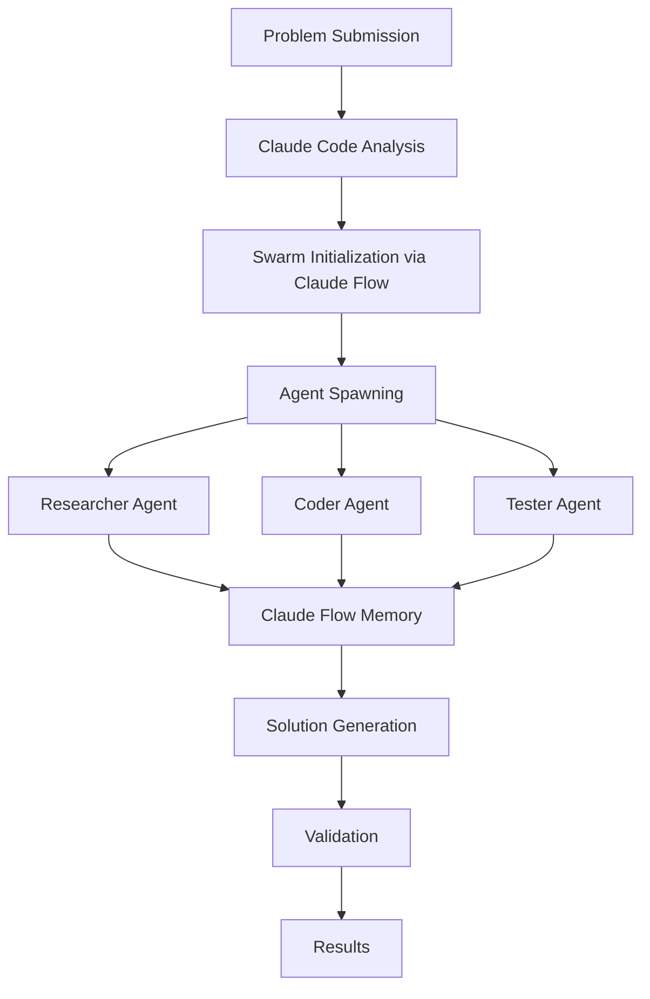

# SWE-Bench Swarm Integration Guide

## Overview

This document explains how Claude Code, Claude Flow, and the SWE-Bench Swarm components work together to solve programming problems.

## Architecture Integration

### 1. Claude Code Integration
Claude Code is the primary code generation and analysis engine:

- **Code Analysis**: Analyzes existing code to understand patterns and requirements
- **Code Generation**: Generates new code based on problem requirements
- **Code Validation**: Validates syntax and logic of generated code
- **Code Optimization**: Optimizes code for performance and best practices

Implementation:
- Located in: `implementation/worker/src/services/claude_code_integration.py`
- Uses Claude Code CLI commands (`claude analyze`, `claude generate`, etc.)
- Requires `ANTHROPIC_API_KEY` environment variable

### 2. Claude Flow MCP Tools
Claude Flow provides swarm coordination and neural capabilities:

- **Swarm Coordination**: `mcp__claude-flow__swarm_init`, `mcp__claude-flow__agent_spawn`
- **Memory Persistence**: `mcp__claude-flow__memory_usage` for cross-session memory
- **Neural Training**: `mcp__claude-flow__neural_train` for pattern learning
- **Performance Monitoring**: `mcp__claude-flow__performance_report`

Implementation:
- Coordinator: `implementation/coordinator/src/services/ClaudeFlowIntegration.ts`
- Workers: Integrated via base agent hooks in `implementation/worker/src/agents/base_agent.py`
- Uses `npx claude-flow@alpha` commands

### 3. Worker Agents
Specialized agents that use both Claude Code and Claude Flow:

#### Researcher Agent
- Uses Claude Code to analyze codebases
- Stores findings in Claude Flow memory
- Coordinates with other agents via hooks

#### Coder Agent
- Uses Claude Code to generate solutions
- Validates code with Claude Code validation
- Shares progress via Claude Flow hooks

#### Tester Agent
- Creates test cases using Claude Code
- Validates solutions against tests
- Reports results through Claude Flow

### 4. Coordination Flow



## Execution Flow

### 1. Problem Analysis Phase
```bash
# Claude Code analyzes the problem
claude analyze --problem "$PROBLEM_ID" --repo "$REPO_NAME"

# Initialize Claude Flow swarm
npx claude-flow@alpha swarm init --topology hierarchical --max-agents 8
```

### 2. Agent Coordination Phase
Each agent runs coordination hooks:
```bash
# Before starting work
npx claude-flow@alpha hooks pre-task --description "Starting analysis"

# After file operations
npx claude-flow@alpha hooks post-edit --file "modified.py"

# Memory storage
npx claude-flow@alpha memory store --key "findings" --value "{...}"
```

### 3. Code Generation Phase
```bash
# Generate code using Claude Code
claude generate --prompt "Fix the bug in function X" --language python

# Validate generated code
claude validate generated_code.py

# Optimize if needed
claude optimize generated_code.py --requirements "performance"
```

### 4. Result Collection Phase
```bash
# Store results in memory
npx claude-flow@alpha memory store --key "solution" --value "{...}"

# Generate performance report
npx claude-flow@alpha performance report --format json
```

## Environment Configuration

### Required Environment Variables
```bash
# Claude Code API
ANTHROPIC_API_KEY=your_api_key
CLAUDE_CODE_ENABLED=true

# Claude Flow
CLAUDE_FLOW_ENABLED=true

# GitHub Integration
GITHUB_TOKEN=your_github_token
```

### Docker Compose Integration
The `docker-compose.yml` includes:
- Environment variable passing to all services
- Volume mounts for Claude Flow memory persistence
- Network configuration for inter-service communication

## Key Integration Points

### 1. ClaudeCodeIntegration Service
- Provides async interface to Claude Code CLI
- Handles code analysis, generation, validation, and optimization
- Falls back gracefully if Claude Code is unavailable

### 2. ClaudeFlowIntegration Service
- Manages swarm lifecycle through MCP tools
- Stores coordination data and task results
- Trains neural patterns from successful solutions

### 3. Agent Hooks
- `_initialize_claude_flow()`: Sets up agent in swarm
- `_run_claude_flow_hook()`: Executes coordination hooks
- `_store_coordination_data()`: Persists data to Claude Flow memory
- `_retrieve_coordination_data()`: Retrieves shared context

## Testing the Integration

### 1. Verify Claude Code
```bash
claude --version
claude analyze test.py
```

### 2. Verify Claude Flow
```bash
npx claude-flow@alpha --version
npx claude-flow@alpha swarm status
```

### 3. Run Integration Test
```bash
# Use the one-liner to test a random problem
curl -sSL https://raw.githubusercontent.com/jedarden/swebench-swarm/main/run-swebench.sh | bash
```

## Troubleshooting

### Claude Code Issues
- Ensure `ANTHROPIC_API_KEY` is set
- Check Claude Code installation: `npm list -g @anthropic/claude-code`
- Verify API access: `claude test`

### Claude Flow Issues
- Check installation: `npm list -g claude-flow`
- Verify MCP server: `npx claude-flow@alpha mcp status`
- Check memory persistence: `npx claude-flow@alpha memory list`

### Integration Issues
- Check logs in `implementation/.swarm/logs/`
- Verify environment variables in `.env`
- Ensure Docker services are running: `docker-compose ps`

## Performance Optimization

### 1. Parallel Agent Execution
- All agents spawn simultaneously
- Work is distributed based on capabilities
- Results are aggregated via Claude Flow memory

### 2. Caching Strategy
- Claude Flow caches analysis results
- Code patterns are stored for reuse
- Neural models learn from successful solutions

### 3. Resource Management
- Agents clean up after task completion
- Memory is compressed periodically
- Unused neural models are pruned

## Future Enhancements

1. **Direct MCP Integration**: Replace CLI calls with native MCP protocol
2. **Enhanced Neural Training**: Train models on larger datasets
3. **Real-time Collaboration**: Live agent communication
4. **Visual Monitoring**: Web UI for swarm visualization
5. **Advanced Caching**: Intelligent result caching based on problem similarity